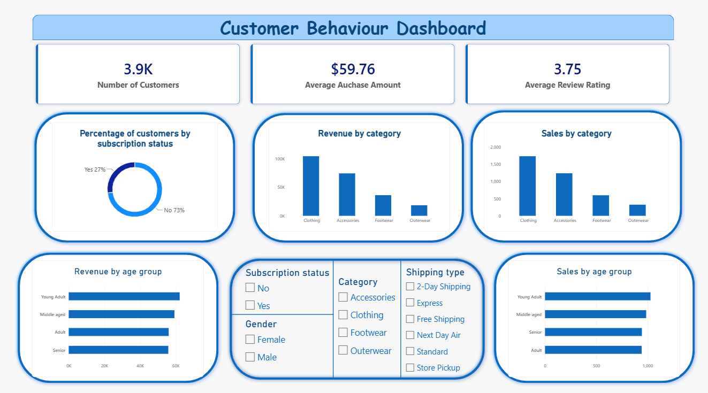

# 🛍️ Customer Shopping Behavior Analysis

End-to-end Customer Shopping Behavior Analysis using **Python, PostgreSQL, and Power BI** to uncover customer spending patterns, product performance, subscription behavior, loyalty trends, and actionable business insights.

---

## 📌 Overview

The goal of this project is to transform raw customer shopping data into meaningful business insights covering spending behavior, product performance, loyalty, and subscription trends.

**Analysis Focus:**

- Customer spending and revenue
- Product and category performance
- Customer loyalty and repeat purchases
- Subscription behavior
- Discounts and promotions
- Age group spending
- Shipping behavior
- Customer reviews and ratings

---

## 📂 Dataset

The project uses a **Customer Shopping Behavior** dataset containing **3,900 purchase records**.

| Column | Description |
|---|---|
| Customer ID | Unique customer identifier |
| Age | Customer age |
| Gender | Customer gender |
| Product Purchased | Product purchased by the customer |
| Category | Product category |
| Purchase Amount | Amount spent on the purchase |
| Location | Customer location |
| Size | Product size |
| Color | Product color |
| Season | Purchase season |
| Review Rating | Customer review rating |
| Subscription Status | Customer subscription status |
| Shipping Type | Shipping method used |
| Discount Applied | Whether a discount was applied |
| Previous Purchases | Number of previous purchases |
| Payment Method | Payment method used |
| Frequency of Purchases | Customer purchase frequency |

**Additional engineered features:**

- `age_group` — Groups customers based on age
- `purchase_frequency_days` — Converts purchase frequency into approximate days

---

## 🛠️ Tools & Technologies

| Tool | Purpose |
|---|---|
| **Python** | Data loading, cleaning, EDA, and feature engineering |
| **Pandas** | Data manipulation and analysis |
| **PostgreSQL** | Database storage and SQL analysis |
| **SQL** | Business questions and analytical queries |
| **Power BI** | Interactive dashboard and visualization |
| **Microsoft PowerPoint** | Presentation creation |

---

## 🔄 Project Workflow

### 1. Data Loading
The customer shopping dataset was loaded into Python using Pandas.

### 2. Exploratory Data Analysis
The dataset was explored using:
- `df.info()`
- `df.describe()`
- Null value checks
- Column inspection
- Basic statistical analysis

### 3. Data Cleaning
- Standardizing column names
- Checking missing values
- Handling missing review ratings using category-level median values
- Removing redundant columns
- Checking data consistency

### 4. Feature Engineering
- `age_group` — Groups customers based on age
- `purchase_frequency_days` — Converts purchase frequency into approximate days

### 5. PostgreSQL Integration
The cleaned DataFrame was loaded into PostgreSQL using **SQLAlchemy** and **psycopg2**.

### 6. SQL Business Analysis
SQL queries were used to answer business questions related to:
- Revenue
- Products
- Subscriptions
- Discounts
- Customer loyalty
- Repeat purchases
- Shipping
- Age groups

### 7. Power BI Dashboard
The cleaned data was connected to Power BI to create an interactive dashboard containing:
- Total purchases
- Average purchase amount
- Average review rating
- Subscription breakdown
- Revenue by category
- Revenue by age group
- Customer behavior insights
- Interactive filters

### 8. Report & Presentation
The findings were summarized in an analysis report and presented through a PowerPoint presentation.

---

## 📊 Dashboard

The Power BI dashboard provides an interactive view of customer shopping behavior, including:

- Revenue Analysis
- Category Performance
- Subscription Behavior
- Customer Loyalty
- Age Group Analysis
- Shipping Analysis
- Product Ratings
- Discount Analysis

  

---

## 🔑 Key Results

### Revenue
- Clothing and Accessories contribute roughly **77% of total revenue**.

### Subscription Behavior
- Subscribers represent approximately **27%** of the dataset.
- Average spending between subscribers and non-subscribers is relatively similar.

### Customer Loyalty
- The customer base contains a large **Loyal** segment.
- Repeat buyers represent a strong opportunity for subscription adoption.

### Product Ratings
- **Gloves** have the highest average review rating among the top-rated products.

### Discounts
- **Hat** has the highest discount rate among the analyzed products.

### Age Groups
- Revenue is relatively balanced across different age groups.

---

## 💡 Business Recommendations

1. **Increase Subscription Adoption** — Provide stronger incentives and benefits to regular customers.
2. **Target Repeat Buyers** — Offer subscriptions to customers who have already demonstrated ongoing engagement.
3. **Review Discount Strategies** — Ensure promotions support sales while protecting profit margins.
4. **Prioritize Key Categories** — Continue prioritizing Clothing and Accessories, which drive the majority of revenue.
5. **Promote Highly Rated Products** — Feature top-rated products in marketing campaigns and recommendations.
6. **Continue Customer Acquisition** — Attract new customers while maintaining strong retention.

---

